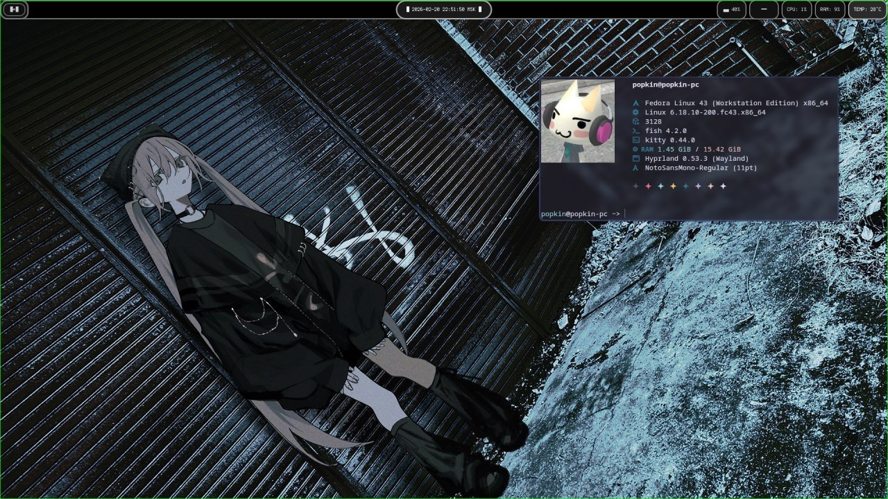
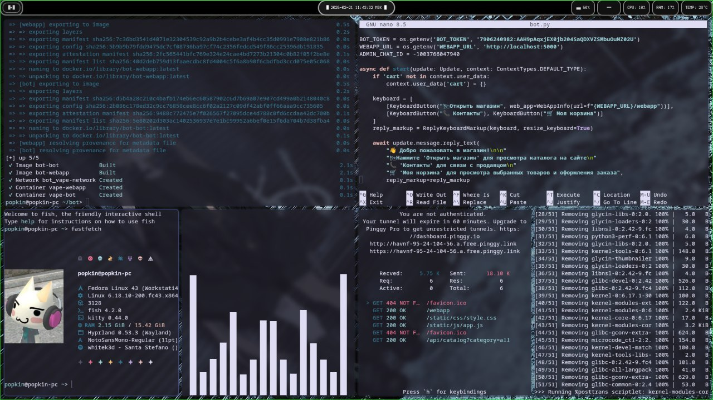

<h1 align="center">✦ Dotfiles ✦</h1>

    <i>These are my personal config files that I use.</i>

<ul>
    <li>OS - fedora</li>
    <li>Terminal - Kitty</li>
    <li>File Manager - Dolphin</li>
    <li>Status bar - waybar</li>
</ul>

Screenshots!

  

  

